# NSPanel Pro Tools Application

This application is a custom developed apk which allows devices running on the 
- Smatek T6E variants
  - Sonoff NSPanel Pro
  - Zemismart T6E
  - Avatto T6E
  - Tuya T6E
- or similar architecture 
  
to leverage certain features such as proximity sensor, light sensor, and Home Assistant integration.

Application mainly tested on NSPanel Pro but may works on other devices.

Donate me if you want:

[](https://www.paypal.com/paypalme/seaky77/1EUR)
[](https://www.paypal.com/paypalme/seaky77/5EUR)
[](https://www.paypal.com/paypalme/seaky77/10EUR)

## Table of contents

- [App version history](#app-version-history)
- [NSPanel Pro device info](#sonoff-nspanel-pro)
- [NSPanel Pro device rooting and sideload](#device-rooting-and-sideload)
- [Install custom launcher](#install-custom-launcher)
- [Install custom webview](#install-custom-webview)
- [Install app](#install-app)
- [Manual for v2.x](#manual-2x-version)
- [Manual for v1.x](#manual-1x-version)


## App Version history
Actual plan is to have a release in every Quarter.

### v2.x.0 (2024-xx)
- set screensaver brightness
- Zigbee gateway integration
  - proxy devices to mqtt
- Automatic App updater
- HA commands
  - json based device configuration
  - play audio
- voice based commands
- mqttv5 ssl

### v2.3.0 (2024-0x)
#### new features
- Zigbee gateway integration
  - possibility to change between router and coordinator mode
- Gesture
  - multitouch gesture detection

### v2.2.2 (2024-07-11)

#### bugfixes
- When Scheduled Reboot is activated, app repeatedly closes itself [Issue #113](https://github.com/seaky/nspanel_pro_tools_apk/issues/113)

### v2.2.1 (2024-06-23)

### improvements
- added Device Admin permission request in order to sleep the device via MQTT [Issue #103](https://github.com/seaky/nspanel_pro_tools_apk/issues/103)

#### bugfixes
- Fixed compatiblity issue with other launchers such as Lawnchair [Issue #104](https://github.com/seaky/nspanel_pro_tools_apk/issues/104)
- It has been made possible to connect MQTT with empty username/password pair [Issue #105](https://github.com/seaky/nspanel_pro_tools_apk/issues/105)

### v2.2.0 (2024-06-14)

Release is dedicated to:


[U.S. Flag day](https://en.wikipedia.org/wiki/Flag_Day_(United_States))


#### new features
- HA commands
  - wake_up device
  - sleep device
  - reboot device
  - switch to launcher
  - enbable adb
- - control sw1,sw2 built-in switches
- Gesture
  - double, triple tap gesture detection (only available firmware under 1.11.0) 
- System enhancement
  - navigation bar by swipe up
  - notification bar by swipe down
- Scheduled reboot
- Application watchdog
#### improvements
- json serialization was fully rewritten, enabler for device provisioning
- mqttv5 client was implemented, enabler for ssl and zigbee
- switched to local broadcast, perf optimization
- auto test covarage was increased
#### bugfixes
- Crash when setup mqtt and main switch is off
- Crash when changing mqtt config (https://github.com/seaky/nspanel_pro_tools_apk/issues/82)

### v2.1.0 (2024-03-15)

Release is dedicated to:


[Hungarian Revolution day](https://en.wikipedia.org/wiki/Hungarian_Revolution_of_1848)
#### new features (see updated manual [Manual 2.x version](#manual-2x-version) )
- [Touch gestures on dark screen](#wake-on-gesture) (https://github.com/seaky/nspanel_pro_tools_apk/issues/27)
- [Wake up from Screen Saver](#wake-from-screensaver) (https://github.com/seaky/nspanel_pro_tools_apk/issues/52)
- [Display sleep mode](#display-sleep-mode) (https://github.com/seaky/nspanel_pro_tools_apk/issues/40)
- [Different Screen-on at weekdays and weekends](#screen-on-begin-on-weekdays) (https://github.com/seaky/nspanel_pro_tools_apk/issues/36)
- [Switch to selected App](#switch-to-app) (https://github.com/seaky/nspanel_pro_tools_apk/issues/46)
- [Home on gesture](#home-on-gesture)
- [MQTT Native Integration](#mqtt-category-v21) (https://github.com/seaky/nspanel_pro_tools_apk/issues/51,https://github.com/seaky/nspanel_pro_tools_apk/issues/10)
- [MQTT Home Assistant integration](#ha-integration) (https://github.com/seaky/nspanel_pro_tools_apk/issues/21)
- [Audio feedback](#audio-feedback)

#### bugfixes
- Brightness between BELOW and ABOVE is not handled properly (https://github.com/seaky/nspanel_pro_tools_apk/issues/55)


### v2.0.1 (2024-01-28)
#### bugfixes
- Restart app after reboot does not work (https://github.com/seaky/nspanel_pro_tools_apk/issues/49)
- Display sleep time UI refresh bug (https://github.com/seaky/nspanel_pro_tools_apk/
issues/47)
- Misleading screen-on begin time calculation (https://github.com/seaky/nspanel_pro_tools_apk/issues/44)

### v2.0 (2024-01-21)
#### new features (see manual [Manual 2.x version](#manual-2x-version) )
- code has been fully redesigned (see [Backward compatibility](#backward-compatibility))
  - a lot easier to add new capabilites
  - enables to add internal event listeners and therby make MQTT/HASS integration 
- new Preference based UI
  - a lot easier to add new UI elemens. Due to the small screen a scrollable view is much more convenient or usable
- screen always on/off feature (https://github.com/seaky/nspanel_pro_tools_apk/issues/5, https://github.com/seaky/nspanel_pro_tools_apk/issues/14)
- reboot device from app (https://github.com/seaky/nspanel_pro_tools_apk/issues/6)
- change hostname from app (https://github.com/seaky/nspanel_pro_tools_apk/issues/8)
- system display sleep time setting from app
- predefinied brightness scenarios based on lightsensor trigger events
- now automatically launched apps can wait for established wifi connection

#### bugfixes
- touch-screen reader memoryleak fixed
- request exclude app from battery optimization, helps to prevent app kill by system
- wake-on-wave can be turned off

### v1.1 (2023-02-02)
- added light sensor feature
  - auto adjust brightness (experimental)
- added set brightness
  - adjust brightness
- optimized toggle operations  
  - preparation for future updates
  - main switch called "active" fully turn off all features of the app including app launch
  - all features can be set independently
- note switch defaults are still off (will be changed in 1.2)
- known bugs
  - trigger label sometimes permanently visible solution: navigate between menus
  - auto adjust brightness level can be very low
  - light menu icon is wrong
> **Note**
> Don't forget to activate main switch


### v1.0 (2023-01-22)
- first production release
- support wakeup on proximity sensor trigger
- support wakeup on touch
- support autolaunch application
- new dark design
- renamed original "ProximityTool" app to "NSPanelTools" app
- moved to new repositroy

### v0.8-alpha (ProximityTool)
- first release
- support wakeup on proximity sensor trigger

## Sonoff NSPanel Pro

Sonoff NSPanel Pro is a smart home control panel which based on Android 8.1 Oreo (AOSP) system.


Device info:
https://itead.cc/product/sonoff-nspanel-pro-smart-home-control-panel/

## Device rooting and sideload

### Gaining ADB access

- Download [ADB drivers](https://developer.android.com/studio/run/win-usb) and install.
- Download [Android platform-tools](https://dl.google.com/android/repository/platform-tools-latest-windows.zip) unzip it to a folder.
- Get device ip address (if you dont know what is ip-address and dont know how to find it do not root the device, you will mess the device up)
> [!TIP]
> You'll find the ip address within Sonoff app settings or in your router dhcp clients view

- Registrate your device with the eWeLink app just follow the device registration process
- To gain ADB access tap on the device id quickly multiple times to enable developer mode
- after you consider the adb agreement you will able to acces device through the adb command
> [!WARNING]
> If you accept the agreement you won't be able to revert it.Your device will be rooted forever. You wont get any new future updates forever. 

> [!TIP]
> With my [RootTool](https://github.com/seaky/nspanel_pro_roottool_apk) app you can update your device

- connect to device with adb

start adb listen:
```
adb tcpip 5555
```

list devices
```
adb devices -l
```

connect device
```
adb connect <ip-address>
```
- Install a custom Launcher (see [Install Launcher](#install-custom-launcher))

### Usefull ADB commands

connect device
```
adb connect <ip-address>
```

list devices
```
adb devices -l
```

press home button
```
adb shell input keyevent 3
```

press power button
```
adb shell input keyevent 26
```

show notifications
```
adb shell cmd statusbar expand-notifications
```

install app
```
adb install <apk>
```

## Install custom launcher

To handle the device more easily, you need to install a custom launcher.

Download [UltraSmall Launcher](https://drive.google.com/file/d/1iW6vWaGAjNTUO_Cs-2r-18j_468mU3oK/view?usp=drive_link)
- install and simulate home key press
- select set "Launcher" as default

## Install custom webview

If you want to use Home Assistant companion app you must update factory provided webview component.

> [!TIP]
> You dont need to instal Xposed root firmware as blackadder mentioned.

Just simple download com.android.webview_108.0.5359.128.apk or any new version which supporst arm64-v8, armeabi-v7a on firmware above 1.5 **Lineageos version** can be installed!

[WebView 108 for firmware >=1.5 ](https://drive.google.com/file/d/1fAO5daUOnUtNlg10KSUmz5feRImZaU9M/view?usp=drive_link)

Under frimware version 1.5 you have two options, update firmware by my frimware updater or simply install this resigned version below.

[WebView 108 for firmware <1.5 ](https://drive.google.com/file/d/1SL7e6uCesPOvakz_LmD829_IFYwK09kC/view?usp=drive_link)

install webview apk
```
adb install -r <webview>
```


## Install App

- Download apk from releases section
- adb install -r [filename.apk]

## Manual 2.x version

- [backward compatibility](#backward-compatibility)
- [main switch](#main-switch)
- [display menu](#display-tab)
- [sensor menu](#sensor-tab)
- [tools menu](#tools-tab)
- [integration menu](#integration-tab-v21)
- [settings menu](#settings-tab)
- [Home Assistant](#home-assistant-integration)
- [Example configuration](#example-configuration)

> [!NOTE]
> If the version number is marked, then it is only valid for that version.

### backward compatibility
version 2.x supports all v1.x features. Except the automatic brightness change which was experimental and replaced by light-level triggered brightness control see [Brightness category]
(#brightness-category).
> [!NOTE]
> All configuration for v1.x is obsolete in 2.x therefore 2.x app must be reconfigured before use.

### main switch
Main switch allows for the complete disabling of the application's functions. Controls the background activities. Purpose of being able to disable the whole app without uninstall.
* active toggle
  * activates a background service which runs even if the app is "killed" from app-switcher
  * off state turns all app features off including "launch app after reboot"

## display tab
This tab groups all screen or display related configurations and features. Such as how and when to turn on and off or how bright is it. etc

****
### wakeup category
****
Category for all wake-up related functions.

Unfortunatelly this [AOSP 8.1](https://source.android.com/) build does not support wakeup device which causes that if official app is not running the device will go to deepsleep.
Due to the lack of power button, just a hard reset (unplug) can wake up the device.

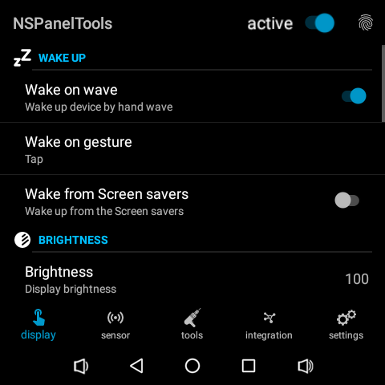

#### Wake-on-wave
Wake up the device by hand wave. 
> [!NOTE]
> Before turning it on, set up the sensor parameters on the sensor tab.

#### Wake on gesture
Wake up the device by touch gesture. Multiple gestures can be selected the behaviour will be the same it will wakes up the device.
> [!IMPORTANT]
> FW Over 1.10.0 wont support touch gestures.

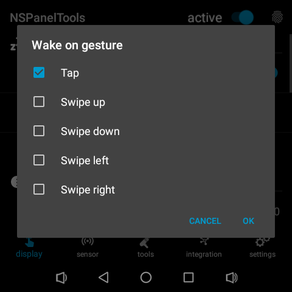

#### Wake from ScreenSaver
Dismiss the ScreenSaver if it is active. Only works if wake-on-wave is enabled.

**** 
### brightness category
****
Category for all brightness related functions.

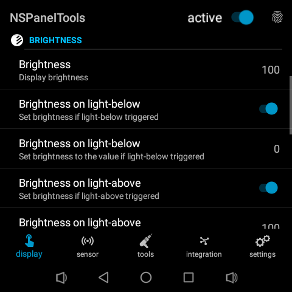

#### Brightness
Set system level display brightness. On certain cases it is used to set if no light change event is triggered.
#### Brightness on light-below switch
Set brightness to the given value if light-below event is triggered. 
> [!NOTE]
> Before turning it on, set up the sensor parameters on the sensor tab.

#### Brightness on light-below seekbar
Set brightness to the prescribed value.

#### Brightness on light-above switch
Set brightness to the given value if light-above event is triggered. 
> [!NOTE]
> Before turning it on, set up the sensor parameters on the sensor tab.

#### Brightness on light-above seekbar
Set brightness to the prescribed value.
****
### screen category
****
Category for all (lcd) screen related functions.

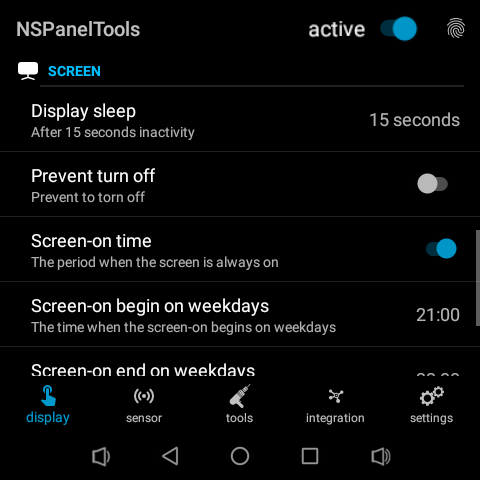

#### Display sleep
Set system level display sleep time. After the prescribed interval the screen will be turned off if another function does not override it, for example: Prevent turn off or Screen begin

#### Display sleep mode
Defines the sleep mode behaviour
- Screen off
  - completely turn the screen off
  > [!IMPORTANT]
  > touch gestures only available in this mode
- Screen dim
  - after prescribed Display sleep time the screen will dim

#### Screen-on time swicth
During a predefinied period it turns on the screen and it remains on untile the end of the interval.

#### Screen-on begin on weekdays
The time when the screen-on begins on weekdays. 

> [!TIP]
> If both begin time and end time is "00:00" it will be disabled or ignored
> If the weekend is disabled, weekdays will jump over weekends. So after friday the monday will be scheduled.
> If the weekend is enabled, after friday the weekend intervall will take effect.

#### Screen-on end on weekdays
The time when the screen-on ends.

#### Screen-on begin on weekends
The time when the screen-on begins at weekends

> [!TIP]
> If both begin time and end time is "00:00" it will be disabled or ignored
> If the weekdays is disabled, weekends will jump over weekdays. So after sunday the next saturday will be scheduled.
> If the weekdays is enabled, after sunday the weekdays intervall will take effect.

#### Screen-on end on weekends
The time when the screen-on ends.


## sensor tab
****
### sensor proximity category
****
Category for proximity sensor related functions.

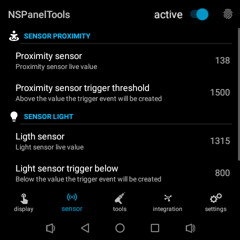

#### Proximity sensor
Proximity sensor live value shows actual sensor value and shows the trigger when it is activated.
#### Proximity sensor trigger threshold
Above the value the trigger event will be create

****
### sensor light category
****
Category for proximity sensor related functions.

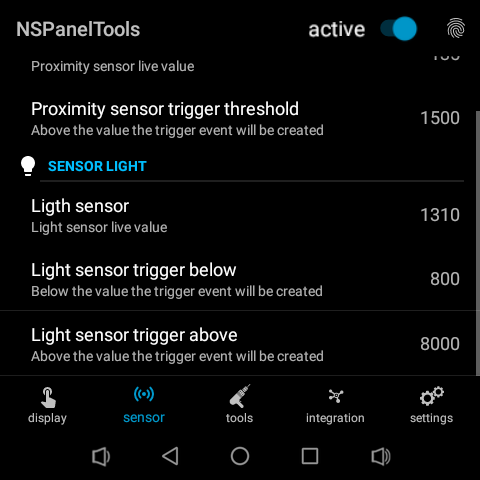

#### Light sensor
Light sensor live value shows actual sensor value and shows the trigger when it is activated.
#### Light sensor trigger below
Below the value the trigger event will be created
#### Light sensor trigger above
Above the value the trigger event will be created

## tools tab
****
### autostart category
****
Autostart or launch other app after device restart

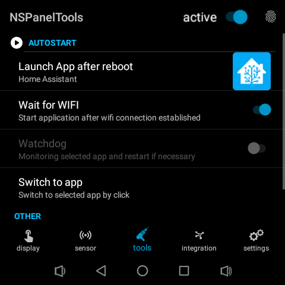
#### Launch App after reboot
Launch selected application after device reboot
#### Wait for WIFI
Start selected application after WIFI connection is established
#### Whatchdog
Monitoring selected app daily if it is not running, then it starts it.
#### Switch to app
Switch to selected application

### system ui (in 2.2.0)
****
#### NavigationBar
Always shows the system level navigation bar.

#### NavigationBar on swipe up
Available if NavigationBar is turned off. An edge swipe up enables the navigation bar for X seconds.

#### NotificationBar on swipe down
Shows the system level notification bar by edge swipe down. Originally it is disabled in Sonoff system.

### other
****

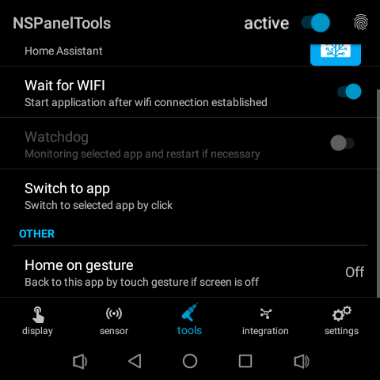

#### Switch to launcher
Switch to default launcher

#### Home on gesture
The selected gesture will switch back to this application.

## integration tab
****

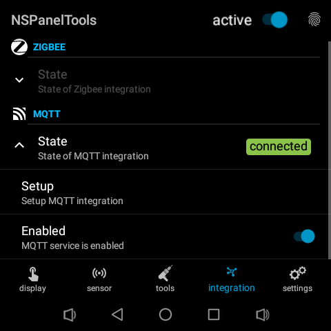
### zigbee category
****
Not yet available planned to v2.2

### mqtt category
****
Category for MQTT and HomeAssistant related settings

#### State
The current state of the connection.

Possible states:
- connecting
  - initiating connection
- connected
  - connection established
- disconnected
  - no live connection
- failure
  - can not establish connection, retry every 5sec 

#### Setup
Setup MQTT Connection
#### Enabled
If turned off the connection will be dissconnected

#### MQTT Setup
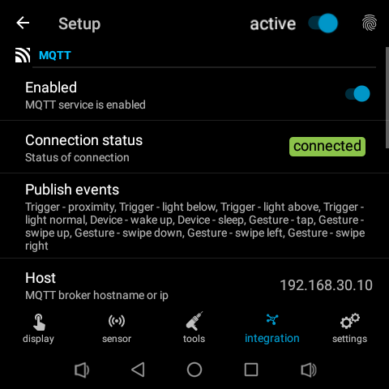
#### Enabled
If turned off the connection will be dissconnected. Turn on only if you setup connection parameters correctly
#### Connection status
The current state of the connection.
#### Publish events
You can select the messages you want to publish on this channel. Only publish those that you really need.

Currently supported events:
- Trigger - proximity
  - send if proximity triggered
- Trigger - light-below
  - send if light-below triggered
- Trigger - light-above
  - send if light-above triggered
- Trigger - light-normal
  - send if light value between below and above
- Device - wake up
  - send if device wake up triggered
- Device - sleep
  - send if device go to sleep, wont be triggered if Display sleep mode is Screen dim
- Gesture - tap
  - send if gesture detected, touch gesture only available when the screen is off
- Gesture - swipe up
  - send if gesture detected, touch gesture only available when the screen is off
- Gesture - swipe down
  - send if gesture detected, touch gesture only available when the screen is off
- Gesture - swipe left
  - send if gesture detected, touch gesture only available when the screen is off
- Gesture - swipe right
  - send if gesture detected, touch gesture only available when the screen is off
#### Enable commands


#### Host
MQTTv3 server host name only non-SSL is available in v2.1
#### Port
MQTTv3 server port only non-SSL is available in v2.1
#### ClienId
MQTTv3 client id
#### Username
Configured username
#### Password
Configured password
#### Use Hostname as Device Id
Automaticall generated Device Id is not quite human friendly, Hostname can be used as deviceid. 

> [!IMPORTANT]
> Hostname must be set

#### Device Id
Unique device id

#### HA Integration
Enables MQTT Integration based integration, events and diagnostics are implemented.

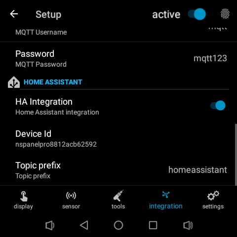

#### HA Integration
If enabled it sends configuration message to the proper topics
> [!TIP]
> In case of configuration trouble, off-on will reconfigure the HA endpoint

#### Topic prefix
Topic prefix usually homeassistant the default

## settings tab
****
### general category
****

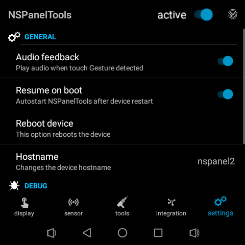
### Audio feedback
Plays audio on certain events such as identified touch gestures on in order to provide audio-based feedback.
### Resume on boot
Autostart NSPanelTools app after device restart
#### Reboot device
This option reboots the device
#### Hostname
Changes the device hostname
### debug category
****

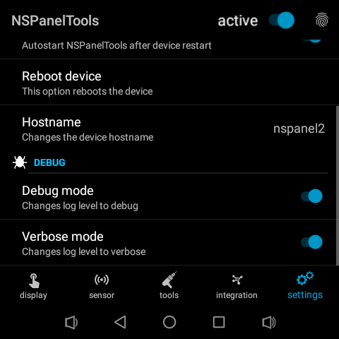
#### Debug mode
Changes log level to debug
#### Verbos mode
Changes log level to verbose
#### View log
Display app log

### Home Assistant integration

Integration based on HA official MQTT module. 

> [!IMPORTANT]
> Currently MQTT Support only non SSL connections.

Configured device data:
- name
- unique id
- manufacturer
- model
- firmware version

Device entities are unique thus generated entity name can be renamed anytime.

#### Entities
If an event has not been sent the value is unknown

#### Diagnostic Sensor
- Sends IP Address string once a day every 24h.
- Receives availability information, if the "eye" icon is gray the device is offline

#### Proximity Event
Sends event when the proximity sensor trigger is occured.
Event values: 
- triggered

#### Touch Event
Sends event when the touch event is triggered. 

> [!IMPORTANT]
> Touch events can only be triggered when the screen is off.

Event values: 
- tap
- swipe_up
- swipe_down
- swipe_left
- swipe_right

#### Light Event
Sends light sensor triggers is occured.
Event values: 
- light_above
- light_below
- light_undefinied

#### Command topic (v2.2)
- reboot device
- sleep
- wake_up
- play custom audio

## Example configuration

### Device config
- wake on wave: on
- wake on gesture: off
- wake from screen saver: off
- brightness: 100
- brightness on light-below: true
- brightness on light-below: 0
- brightness on light-above: true
- brightness on light-below: 100
- display sleep: 15
- prevent turn off: off
- screen-on time: on
- screen-on time begin weekdays: 07:00
- screen-on time end weekdays: 09:00
- screen-on time begin weekends: 08:00
- screen-on time end weekends: 10:00
- launch app after reboot: Home Assistant
- wait for wifi: on
- home on gesture: swipe-right
- mqtt enable: on
- publish events: tap, swipe-up, swipe-down, swipe-left
- ha integration: on
- auido feddback: on
- resume on reboot: on
- hostname: nspanel#
- debug: off

### HASS Example uses-cases
- Room: Automation for touch events, every room has its own automation
  - swipe_up: shutter open
  - swipe_down: shutter close
  - tap: shutter stop
  - swipe_left: turn light on / off
  - proximity: wake up device

- Entrance: Special configuration for home entrance
  - swipe_up: I'm home -> shutters up, air vent on
  - swipe_down: Leave home -> electricity off, shutters close
  - swipe_right: #1 garage door open/closew
  - swipe_left: #2 garage door open/close
  - tap: wake up device
  - proximity: wake up device

#### Automation sample yaml
```alias: bedroom_device2
description: "bedroom nspanel2 automation"
trigger:
  - platform: state
    entity_id:
      - event.nspanel2_touch
    attribute: event_type
condition: []
action:
  - choose:
      - conditions:
          - condition: state
            entity_id: event.nspanel2_touch
            attribute: event_type
            state: swipe_up
        sequence:
          - service: cover.open_cover
            target:
              entity_id:
                - cover.rollershutter_0013
              device_id: []
              area_id: []
            data: {}
      - conditions:
          - condition: state
            entity_id: event.nspanel2_touch
            attribute: event_type
            state: swipe_down
        sequence:
          - service: cover.close_cover
            target:
              entity_id: cover.rollershutter_0013
            data: {}
      - conditions:
          - condition: state
            entity_id: event.nspanel2_touch
            attribute: event_type
            state: swipe_right
        sequence:
          - service: cover.stop_cover
            target:
              entity_id: cover.rollershutter_0013
            data: {}
mode: single
```

## Manual 1.x version

### main switch
Switch controls the background activities. Purpose of being able to disable the whole app without uninstall.
* active toggle
  * activates a background service which runs even if the app is "killed" from app-switcher
  * off state turns all app features off including launch app after reboot

### wake up
Unfortunatelly this AOSP build does not support wakeup device which causes if official app is not running the device will go to deepsleep.
Due to the lack of power button, just a hard reset (unplug) can wake up the device.

Wake up on wave and touch feature are implemented in the app btw that was the original purpose of the app.
* wake-on-wave
  * toggle state is presisted
  * feature activates itself if the screen goes off
  * this option observes the proximity sensor gestures
* wake-on-touch
  * panel touch will also wakes up the device
  * feature activates itself if the screen goes off
  * this option observes the panel touch
* resume on boot
  * start the selected app after reboot automatically
  * feature activates itself after reboot
  * after the reboot this app may not visible in app switcher, nonetheless the background service will be active  

### launch
This feature enables to run an application as a default app such as HomeAsistant.
* select
  * select installed application if launch on startup activated the app selection is disabled
  * always test it with test button before activates 
* launch on startup 
  * runs the selected app after reboot
* test button
  * launch the selected app

### light
This feature enables utilization of light sensor. 
* set brightness
  * panel brightness can be changed manually
  * if auto adjust is turned on it shows the calculated brightness value in relatime
* auto adjust brightness
  * automatically calculates and adjust the brightness based on sensed lux 
