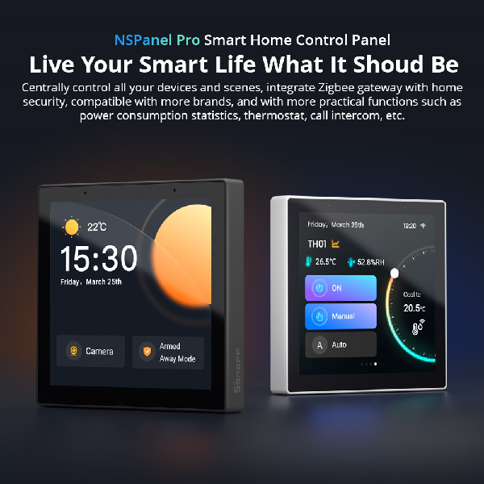

# NSPanel Pro Tools Application
## Version history

### v1.x (planned features)
- HA integration

### v1.2 (planned features)
- fix known bugs
- add setup display sleep setting from app
- add reboot https://github.com/seaky/nspanel_pro_tools_apk/issues/6
- add modify auto-adjust-brightness parameters
- investigate feature request https://github.com/seaky/nspanel_pro_tools_apk/issues/5

### v1.1 (2023-02-02)
- added light sensor feature
  - auto adjust brightness (experimental)
- added set brightness
  - adjust brightness
- optimized toggle operations  
  - preparation for future updates
  - active switch fully turn off all features of the app including app launch
  - all features can be set independently
- note switch defaults are still off (will be changed in 1.2)
- known bugs
  - trigger label sometimes permanently visible solution: navigate between menus
  - auto adjust brightness level can be very low
> **Note**
> Don't forget to activate main switch

### v1.0 (2023-01-22)
- first production release
- support wakeup on proximity sensor trigger
- support wakeup on touch
- support autolaunch application
- new dark design
- renamed original "ProximityTool" app to "NSPanelTools" app
- moved to new repositroy

### v0.8-alpha (ProximityTool)
- first release
- support wakeup on proximity sensor trigger

## Sonoff NSPanel Pro

Sonoff NSPanel Pro is a smart home control panel which based on Android 8.1 Oreo (AOSP) system.

After gain ADB access custom applications can be installed onto this unit. See (https://blakadder.com/nspanel-pro-sideload/)

https://itead.cc/product/sonoff-nspanel-pro-smart-home-control-panel/

## Manual for v1.1
## ADB Access
https://blakadder.com/nspanel-pro-sideload/

> **Note**
> In order to make the display turn off when not in use, you may change the display sleep settings (`Settings -> Display -> Advanced -> Sleep`).

> **Warning**
> Consequence of gaining ADB access the device won't get any official update and the device will be marked as rooted permanently.
 
## Install
Unable to install third-part applications without gain ADB access.

- Download apk
- adb install -r <filename>.apk

## Features
### main switch
Switch controls the background activities. Purpose of being able to disable the whole app without uninstall.
* active toggle
  * activates a background service which runs even if the app is "killed" from app-switcher
  * off state turns all app features off including launch app after reboot
### wakeup
Unfortunatelly this AOSP build does not support wakeup device which causes if official app is not running the device will go to deepsleep.
Due to the lack of power button, just a hard reset (unplug) can wake up the device.

Wake up on wave and touch feature are implemented in the app btw that was the original purpose of the app.
* wake-on-wave
  * toggle state is presisted
  * feature activates itself if the screen goes off
  * this option observes the proximity sensor gestures
* wake-on-touch
  * panel touch will also wakes up the device
  * feature activates itself if the screen goes off
  * this option observes the panel touch
* resume on boot
  * start the selected app after reboot automatically
  * feature activates itself after reboot
  * after the reboot this app may not visible in app switcher, nonetheless the background service will be active  

### launch
This feature enables to run an application as a default app such as HomeAsistant.
* select
  * select installed application if launch on startup activated the app selection is disabled
  * always test it with test button before activates 
* launch on startup 
  * runs the selected app after reboot
* test button
  * launch the selected app

### light
This feature enables utilization of light sensor. 
* set brightness
  * panel brightness can be changed manually
  * if auto adjust is turned on it shows the calculated brightness value in relatime
* auto adjust brightness
  * automatically calculates and adjust the brightness based on sensed lux 
