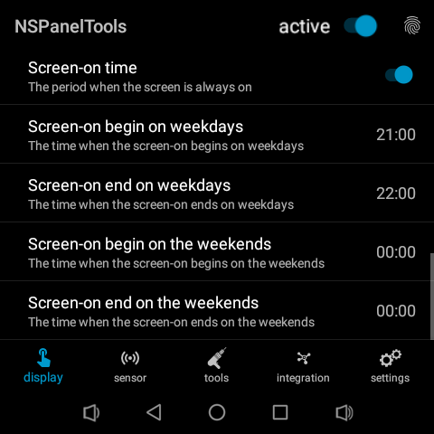

# NSPanel Pro Tools Application

This application is a custom developed apk which allows devices running on the 
- Smatek T6E variants
  - Sonoff NSPanel Pro
  - Zemismart T6E
  - Avatto T6E
  - Tuya T6E
- or similar architecture 
  
to leverage certain features such as proximity sensor, light sensor, and Home Assistant integration.

Application mainly tested on NSPanel Pro but may works on other devices.

Donate me if you want:

[](https://www.paypal.com/paypalme/seaky77/1EUR)
[](https://www.paypal.com/paypalme/seaky77/5EUR)
[](https://www.paypal.com/paypalme/seaky77/10EUR)

## Table of contents

- [App version history](#app-version-history)
- [NSPanel Pro device info](#sonoff-nspanel-pro)
- [NSPanel Pro device rooting and sideload](#device-rooting-and-sideload)
- [Install custom launcher](#install-custom-launcher)
- [Install custom webview](#install-custom-webview)
- [Install app](#install-app)
- [Manual for v2.x](#manual-2x-version)
- [Manual for v1.x](#manual-1x-version)


## App Version history
Actual plan is to have a release in every Quarter.

### v2.x.0 (2024-xx)
- set screensaver brightness
- Automatic App updater
- HA commands
    - play audio
- voice based commands
- mqttv5 ssl/tls

### v2.3.3 Beta is open (2025-03-01)

- [see the details here](https://github.com/seaky/nspanel_pro_tools_apk/discussions/208) 

### v2.3.2 (2025-01-18)

Release is dedicated to:


[National Winnie The Pooh Day](https://en.wikipedia.org/wiki/Winnie-the-Pooh)

#### new features
- zstack packages are available currently: Sonoff, z2m
- ability to monitor/report gpio changes - default is off
  - available on sensor page
- armv7 support added

#### bugfixes
- Fixed [Brightness sometimes set to 0 even if light-events are not used](https://github.com/seaky/nspanel_pro_tools_apk/issues/178)
- Fixed [Display sleep mode not working](https://github.com/seaky/nspanel_pro_tools_apk/issues/176)

#### Thanks to beta-testers
Special thanks to the beta testers for their thorough and prompt testing, as well as their patience.

- maodun96
- pvklink


### v2.3.2 Beta3 (2025-01-04)
- New Beta3 is available, [see the details here](https://github.com/seaky/nspanel_pro_tools_apk/discussions/164) 

#### changed
- package installer has been fully rewritten
- packages are configurable at /data/local/nspanel_tools_pkg/\<package type\>/config
- beta1-2 packages has been deleted due to compatibility

#### new features
- zigbee2mqtt package is now available to install
- ability to monitor/report gpio changes - default is off
  - available on sensor page

### v2.3.2 Beta1 (2024-11-29)
- Beta1 is available, [see the details here](https://github.com/seaky/nspanel_pro_tools_apk/discussions/164) 

### v2.3.1 (2024-11-20)

#### hotfix
- v2.3.0 crashes on devices other than NSPanel Pro, such as my S6E. - [Issue #145](https://github.com/seaky/nspanel_pro_tools_apk/issues/156)
- MQTT Client errors were not correctly handled

#### new features
- ability to turn on/off zigbee feature - default is off

### v2.3.0 (2024-11-19)

Release is dedicated to:


- Happy name day to my Mom ( a celebration widespread in European culture)

#### new features
- [Zigbee gateway integration](#zigbee-category) - [Feature Request #39](https://github.com/seaky/nspanel_pro_tools_apk/issues/39)
  - (The end of a long research, but the beginning of a long adventure)
  - possibility to change between router and coordinator mode
  - custom firmware feature still not available but Beta will be available soon
- [Remote / MQTT app configuration](#commands) - [Feature Request #109](https://github.com/seaky/nspanel_pro_tools_apk/issues/109)
- Wake on network error. If network error occurs it assits to the OS to reconnect. - [Feature Request #154](https://github.com/seaky/nspanel_pro_tools_apk/issues/154)
- Free usage of light sensor events - [Feature Request #101](https://github.com/seaky/nspanel_pro_tools_apk/issues/101)
- Set sleep time via MQTT - [Feature Request #107](https://github.com/seaky/nspanel_pro_tools_apk/issues/107)
- Switch to default app via MQTT - [Feature Request #106](https://github.com/seaky/nspanel_pro_tools_apk/issues/106)

#### improvements
- MqttClient has been optimzed and refactored
- MqttModule has been heavily refactored in order to support Zigbee
- App configuration method has been completly rewritten in order to support json based configuration
- Integration fragment has been completly rewritten in order to support multiple mqtt connection
- Settings tab now displays Device Info
- Introduce PowerManagement module to enable wakeup device temporary or permanently

### bugfixes
- Module manager start order was not correct
- MQTT Lightsensor light_normal event was not handled correctly
- IP Address is not reported correctly - [Issue #108](https://github.com/seaky/nspanel_pro_tools_apk/issues/108)


### v2.2.4 (2024-10-07)


#### bugfixes
- Wake on Wave for Screensaver does not work - [Issue #145](https://github.com/seaky/nspanel_pro_tools_apk/issues/145)
- Pro Tools keep crashing on tap after screen off - [Issue #143](https://github.com/seaky/nspanel_pro_tools_apk/issues/143)
- Proximity sensor trigger label on sensor tab keeps visible after trigger

> **Note**
> Wake-on-Screensaver toggle has been removed because the new wake-on-wave method handles as well

### v2.2.3 (2024-09-27)

Convenience update due to the release of a new device 120p

#### new features
- Support of 120p
- Set display rotation
- Control Screen-on screen dim behaviour

#### bugfixes
- Proximity wake-up no longer working after wake-up signal is sent via MQTT - [Issue #115](https://github.com/seaky/nspanel_pro_tools_apk/issues/115)

### v2.2.2 (2024-07-11)

#### bugfixes
- When Scheduled Reboot is activated, app repeatedly closes itself - [Issue #113](https://github.com/seaky/nspanel_pro_tools_apk/issues/113)

### v2.2.1 (2024-06-23)

### improvements
- added Device Admin permission request in order to sleep the device via MQTT - [Issue #103](https://github.com/seaky/nspanel_pro_tools_apk/issues/103)

#### bugfixes
- Fixed compatiblity issue with other launchers such as Lawnchair - [Issue #104](https://github.com/seaky/nspanel_pro_tools_apk/issues/104)
- It has been made possible to connect MQTT with empty username/password pair - [Issue #105](https://github.com/seaky/nspanel_pro_tools_apk/issues/105)

### v2.2.0 (2024-06-14)

Release is dedicated to:


[U.S. Flag day](https://en.wikipedia.org/wiki/Flag_Day_(United_States))


#### new features
- HA commands
  - wake_up device
  - sleep device
  - reboot device
  - switch to launcher
  - enbable adb
- - control sw1,sw2 built-in switches
- Gesture
  - double, triple tap gesture detection (only available firmware under 1.11.0) 
- System enhancement
  - navigation bar by swipe up
  - notification bar by swipe down
- Scheduled reboot
- Application watchdog
#### improvements
- json serialization was fully rewritten, enabler for device provisioning
- mqttv5 client was implemented, enabler for ssl and zigbee
- switched to local broadcast, perf optimization
- auto test covarage was increased
#### bugfixes
- Crash when setup mqtt and main switch is off
- Crash when changing mqtt config [Issue #82](https://github.com/seaky/nspanel_pro_tools_apk/issues/82)

### v2.1.0 (2024-03-15)

Release is dedicated to:


[Hungarian Revolution day](https://en.wikipedia.org/wiki/Hungarian_Revolution_of_1848)
#### new features (see updated manual [Manual 2.x version](#manual-2x-version) )
- [Touch gestures on dark screen](#wake-on-gesture) (https://github.com/seaky/nspanel_pro_tools_apk/issues/27)
- [Wake up from Screen Saver](#wake-from-screensaver) (https://github.com/seaky/nspanel_pro_tools_apk/issues/52)
- [Display sleep mode](#display-sleep-mode) (https://github.com/seaky/nspanel_pro_tools_apk/issues/40)
- [Different Screen-on at weekdays and weekends](#screen-on-begin-on-weekdays) (https://github.com/seaky/nspanel_pro_tools_apk/issues/36)
- [Switch to selected App](#switch-to-app) (https://github.com/seaky/nspanel_pro_tools_apk/issues/46)
- [Home on gesture](#home-on-gesture)
- [MQTT Native Integration](#mqtt-category-v21) (https://github.com/seaky/nspanel_pro_tools_apk/issues/51,https://github.com/seaky/nspanel_pro_tools_apk/issues/10)
- [MQTT Home Assistant integration](#ha-integration) (https://github.com/seaky/nspanel_pro_tools_apk/issues/21)
- [Audio feedback](#audio-feedback)

#### bugfixes
- Brightness between BELOW and ABOVE is not handled properly (https://github.com/seaky/nspanel_pro_tools_apk/issues/55)


### v2.0.1 (2024-01-28)
#### bugfixes
- Restart app after reboot does not work (https://github.com/seaky/nspanel_pro_tools_apk/issues/49)
- Display sleep time UI refresh bug (https://github.com/seaky/nspanel_pro_tools_apk/
issues/47)
- Misleading screen-on begin time calculation (https://github.com/seaky/nspanel_pro_tools_apk/issues/44)

### v2.0 (2024-01-21)
#### new features (see manual [Manual 2.x version](#manual-2x-version) )
- code has been fully redesigned (see [Backward compatibility](#backward-compatibility))
  - a lot easier to add new capabilites
  - enables to add internal event listeners and therby make MQTT/HASS integration 
- new Preference based UI
  - a lot easier to add new UI elemens. Due to the small screen a scrollable view is much more convenient or usable
- screen always on/off feature (https://github.com/seaky/nspanel_pro_tools_apk/issues/5, https://github.com/seaky/nspanel_pro_tools_apk/issues/14)
- reboot device from app (https://github.com/seaky/nspanel_pro_tools_apk/issues/6)
- change hostname from app (https://github.com/seaky/nspanel_pro_tools_apk/issues/8)
- system display sleep time setting from app
- predefinied brightness scenarios based on lightsensor trigger events
- now automatically launched apps can wait for established wifi connection

#### bugfixes
- touch-screen reader memoryleak fixed
- request exclude app from battery optimization, helps to prevent app kill by system
- wake-on-wave can be turned off

### v1.1 (2023-02-02)
- added light sensor feature
  - auto adjust brightness (experimental)
- added set brightness
  - adjust brightness
- optimized toggle operations  
  - preparation for future updates
  - main switch called "active" fully turn off all features of the app including app launch
  - all features can be set independently
- note switch defaults are still off (will be changed in 1.2)
- known bugs
  - trigger label sometimes permanently visible solution: navigate between menus
  - auto adjust brightness level can be very low
  - light menu icon is wrong
> **Note**
> Don't forget to activate main switch


### v1.0 (2023-01-22)
- first production release
- support wakeup on proximity sensor trigger
- support wakeup on touch
- support autolaunch application
- new dark design
- renamed original "ProximityTool" app to "NSPanelTools" app
- moved to new repositroy

### v0.8-alpha (ProximityTool)
- first release
- support wakeup on proximity sensor trigger

# Sonoff NSPanel Pro

Sonoff NSPanel Pro is a smart home control panel which based on Android 8.1 Oreo (AOSP) system.


Device info:
https://itead.cc/product/sonoff-nspanel-pro-smart-home-control-panel/

# Device rooting and sideload

## Gaining ADB access

- Download [ADB drivers](https://developer.android.com/studio/run/win-usb) and install.
- Download [Android platform-tools](https://dl.google.com/android/repository/platform-tools-latest-windows.zip) unzip it to a folder.
- Get device ip address (if you dont know what is ip-address and dont know how to find it do not root the device, you will mess the device up)
> [!TIP]
> You'll find the ip address within Sonoff app settings or in your router dhcp clients view

- Registrate your device with the eWeLink app just follow the device registration process
- To gain ADB access tap on the device id quickly multiple times to enable developer mode
- after you consider the adb agreement you will able to acces device through the adb command
> [!WARNING]
> If you accept the agreement you won't be able to revert it.Your device will be rooted forever. You wont get any new future updates forever. 

> [!TIP]
> With my [RootTool](https://github.com/seaky/nspanel_pro_roottool_apk) app you can update your device

- connect to device with adb

start adb listen:
```
adb tcpip 5555
```

list devices
```
adb devices -l
```

connect device
```
adb connect <ip-address>
```
- Install a custom Launcher (see [Install Launcher](#install-custom-launcher))

## Usefull ADB commands

connect device
```
adb connect <ip-address>
```

list devices
```
adb devices -l
```

press home button
```
adb shell input keyevent 3
```

press power button
```
adb shell input keyevent 26
```

show notifications
```
adb shell cmd statusbar expand-notifications
```

install app
```
adb install <apk>
```

## Install custom launcher

To handle the device more easily, you need to install a custom launcher.

Download [UltraSmall Launcher](https://drive.google.com/file/d/1iW6vWaGAjNTUO_Cs-2r-18j_468mU3oK/view?usp=drive_link)
- install and simulate home key press
- select set "Launcher" as default

## Install custom webview

If you want to use Home Assistant companion app you must update factory provided webview component.

> [!TIP]
> You dont need to instal Xposed root firmware as blackadder mentioned.

Just simple download com.android.webview_108.0.5359.128.apk or any new version which supporst arm64-v8, armeabi-v7a on firmware above 1.5 **Lineageos version** can be installed!

[WebView 108 for firmware >=1.5 ](https://drive.google.com/file/d/1fAO5daUOnUtNlg10KSUmz5feRImZaU9M/view?usp=drive_link)

Under frimware version 1.5 you have two options, update firmware by my frimware updater or simply install this resigned version below.

[WebView 108 for firmware <1.5 ](https://drive.google.com/file/d/1SL7e6uCesPOvakz_LmD829_IFYwK09kC/view?usp=drive_link)

install webview apk
```
adb install -r <webview>
```


## Install App

- Download apk from releases section
- adb install -r [filename.apk]

# Manual 2.x version

- [backward compatibility](#backward-compatibility)
- [main switch](#main-switch)
- [display menu](#display-tab)
- [sensor menu](#sensor-tab)
- [tools menu](#tools-tab)
- [integration menu](#integration-tab-v21)
- [settings menu](#settings-tab)
- [Home Assistant / MQTT](#home-assistant-integration)
- [ZStack packages](#zstack-packages)
- [Example configuration](#example-configuration)

> [!NOTE]
> If the version number is marked, then it is only valid for that version.

## active switch
The "active" switch is a master toggle that allows all application functions to be turned off simultaneously. Its purpose is to disable the entire operation without uninstalling the app.

When the switch is set to on:
  * It activates services that continue running even if the application is not in the foreground or is killed from the app switcher.

When the switch is set to off:
  * everything is disabled, including the "launch app after reboot" function.

## display tab
This tab groups all settings related to screens or displays in one place. Here, you can configure when the screen turns on and off and adjust its brightness.

### wakeup category
***
This category groups all functions related to wake-up actions.

The AOSP 8.1 build for this device does not support wake functionality. If the factory application is not running, the device may enter deep sleep. Without a power button, the only way to wake the device is to unplug it from the outlet.


_The image might be showing an older version._

#### Wake-on-wave
Wakes the device with a hand wave. 
> [!NOTE]
> Before turning it on, set up the sensor parameters on the sensor tab.

#### Wake on gesture
Wakes the device using a touch gesture. Multiple gestures can be assigned simultaneously, and detecting any of them will wake the device.
> [!IMPORTANT]
> FW Over 1.10.0 wont support touch gestures.

  
_The image might be showing an older version._

#### Wake on network error
Wakes the device if it disconnects from the network to support reconnection. In some cases, the device will only reconnect to the network if the display is on.


### brightness category
***
This category organizes all functions related to adjusting the display brightness.

  
_The image might be showing an older version._

#### Brightness
Sets the system-wide display brightness.
> [!NOTE]
> This setting is ineffective if adaptive brightness is enabled.

#### Brightness on light-below switch
Sets the display brightness to this value when a "light-below" event is triggered.
> [!NOTE]
> Before enabling this, ensure the sensor values are correctly configured for proper functionality.

#### Brightness on light-below seekbar
Adjusts the desired display brightness value.

#### Brightness on light-above switch
Sets the display brightness to this value when a "light-above" event is triggered.
> [!NOTE]
> Before enabling this, ensure the sensor values are correctly configured for proper functionality.

#### Brightness on light-above seekbar
Adjusts the desired display brightness value.

### screen category
***
This category groups all functions related to the screen.

  
_The image might be showing an older version._

#### Display sleep
Sets the system-wide screen timeout duration. If the screen is inactive, it will enter sleep mode after this period.

#### Display sleep mode
Configures what happens to the screen during sleep mode.
- Screen off
  - completely turn the screen off
  > [!IMPORTANT]
  > Touch gestures are only available when the screen is turned off.
- Screen dim
  - Puts the screen into a dimmed state during sleep mode. Dimmed mode means reduced brightness.

#### Screen-on time
The Screen-on function turns the screen on at a specified time. Separate schedules can be set for weekdays and weekends.

#### Screen-on prevent screen dim
Prevents the screen from dimming when the Screen-on function is active.

#### Screen-on begin on weekdays
The time when the screen-on begins on weekdays. 

> [!TIP]
> If both begin time and end time is "00:00" it will be disabled or ignored
> If the weekend is disabled, weekdays will jump over weekends. So after friday the monday will be scheduled.
> If the weekend is enabled, after friday the weekend intervall will take effect.

#### Screen-on end on weekdays
The time when the screen-on ends.

#### Screen-on begin on weekends
The time when the screen-on begins at weekends

> [!TIP]
> If both begin time and end time is "00:00" it will be disabled or ignored
> If the weekdays is disabled, weekends will jump over weekdays. So after sunday the next saturday will be scheduled.
> If the weekdays is enabled, after sunday the weekdays intervall will take effect.

#### Screen-on end on weekends
The time when the screen-on ends.

  
_The image might be showing an older version._

## sensor tab
All settings related to sensors are grouped here.

### sensor proximity category
****
Category for proximity sensor related functions.

  
_The image might be showing an older version._

#### Proximity sensor
Proximity sensor live value displays the current value of the sensor and indicates when a trigger occurs.
#### Proximity sensor trigger threshold
The threshold value at which the trigger should activate.
> [!NOTE]
>  For firmware versions above FW3.0, the sensor value is fixed and cannot be adjusted.   
> The sensor has two states:  
>   0: Not detecting  
>   1: Detecting  
> Proximity cannot be fine-tuned.

### sensor light category
****
This category includes functions related to the light sensor.

  
_The image might be showing an older version._

#### Light sensor
Light sensor live value shows the real-time value of the sensor and indicates when the trigger is activated.
#### Light sensor trigger below
Creates a trigger event when the value falls below the set threshold.
#### Light sensor trigger above
 Creates a trigger event when the value exceeds the set threshold.

#### GPIO sensor
Monitors changes on two GPIO ports at a specified interval and generates an event when a change occurs.

## tools tab
This tab groups various useful functions.

### autostart category
****
Automatically launches the configured application after the device restarts.

  
_The image might be showing an older version._

#### Launch App after reboot
Launch selected application after device reboot
#### Wait for WIFI
Delays the application start until a Wi-Fi connection is established.
#### Whatchdog
Monitors the application and restarts it if it is not running.
#### Switch to app
Launches and brings the specified application to the foreground.

### system ui
****
This tab contains all settings related to the system UI.
#### NavigationBar
Enables the system level navigation bar.

#### NavigationBar on swipe up
Displays the navigation bar with a swipe-up gesture and hides it after 10 seconds.

#### NotificationBar on swipe down
Displays the notification bar with a swipe-down gesture.

### other
****

  
_The image might be showing an older version._

#### Switch to launcher
Switches to the Launcher.

#### Home on gesture
Switches to this application when the assigned gesture is detected.

## integration tab
This tab contains all settings for external system integrations.

  
_The image might be showing an older version._

### zigbee category
****
Related to the Zigbee stack integration.

#### State
The current state of the connection.

Possible states can be:
- connecting
  - Connection in progress
- connected
  -  Connected to the MQTT server but has not reported its state yet.
- online
  - The Zigbee stack is online.
- offline
  - The Zigbee stack is offline.
- failure
  -  Failed to connect to the MQTT server, will be retried in every 5sec.

#### Setup
Integration settings, including enabling or disabling the integration.
> [!NOTE] 
> When disabled, the external integration still runs, but the application does not monitor it.

#### Role
The role of the Zigbee device.
Possible values can be:
- Coordinator
- Router

### Zigbee Setup

#### State
The current state of the connection.

Possible states can be:
- connecting
  - Connection in progress
- connected
  -  Connected to the MQTT server but has not reported its state yet.
- online
  - The Zigbee stack is online.
- offline
  - The Zigbee stack is offline.
- failure
  -  Failed to connect to the MQTT server, will be retried in every 5sec.

#### Role
The role of the Zigbee device.
Possible values can be:
- Coordinator
- Router

Coordinator:
- act as Zigbee coordinator, devices can be paired via Official Applications

Repeater:
- act as Zigbee Repeater or Router. Pairing is available.

#### Permit join (Coordinator mode)
Allows new devices to join.

#### List devices (Coordinator mode)
Displays the list of connected devices and allows device disconnection.
Important: Disconnection only occurs if the end device is awake.

#### Pairing (Router mode)
Puts device to pairing mode for 180 sec after timeout it will turn off automatically.
Allows other Coordinators to pair with this device and integrate it into their own mesh network as a Repeater/Router.

#### Zigbee Gateway Version
Enables ZStack package installation (see: [ZStack packages](#zstack-packages)). After selecting a package, click the Install button to start the installer.

On the installer page two options can be selected:
- keep configuration
- keep data
These options preserve the state and settings of connected devices when installing a new package version.

#### Factory reset
Restores the factory ZStack.

#### MQTT
The ZStack monitoring and API calls are based on MQTT messages. This section allows you to configure the MQTT connection parameters for integration. By default, a local MQTT broker is installed on the device, but in some cases (e.g., with Z2M), you might want to use a central MQTT broker, such as in the case of HASS integration.

### MQTT category
****
This is where you configure the NSPanel Pro MQTT integration, enabling the features and events provided by the NSPanel Pro app to be accessible via MQTT.  

When enabled, the integration will attempt to connect using the connection details specified in the configuration parameters. Only enable this if you’ve already set up the parameters correctly.

#### State
The current state of the connection.

Possible states:
- connecting
  - initiating connection
- connected
  - connection established
- disconnected
  - no live connection
- failure
  - can not establish connection, retry every 5sec 

#### Setup
Setup MQTT Connection
#### Enabled
If turned off the connection will be dissconnected

#### MQTT Setup

#### Enabled
When enabled, the integration will attempt to connect using the connection details specified in the configuration parameters. Only enable this if you’ve already set up the parameters correctly.
#### Connection status
The current state of the connection.
#### Publish events
You can select the messages you want to publish on this channel. Only publish those that you really need.

Currently supported events:
- Trigger - proximity
  - send if proximity triggered
- Trigger - light-below
  - send if light-below triggered
- Trigger - light-above
  - send if light-above triggered
- Trigger - light-normal
  - send if light value between below and above
- Device - wake up
  - send if device wake up triggered
- Device - sleep
  - send if device go to sleep, wont be triggered if Display sleep mode is Screen dim
- Gesture - tap
  - send if gesture detected, touch gesture only available when the screen is off
- Gesture - swipe up
  - send if gesture detected, touch gesture only available when the screen is off
- Gesture - swipe down
  - send if gesture detected, touch gesture only available when the screen is off
- Gesture - swipe left
  - send if gesture detected, touch gesture only available when the screen is off
- Gesture - swipe right
  - send if gesture detected, touch gesture only available when the screen is off
#### Enable commands
Allows commands to be sent via MQTT. (see: [MQTT Command](#commands))

#### Host
MQTTv3 server host name only non-SSL is available in v2.1
#### Port
MQTTv3 server port only non-SSL is available in v2.1
#### ClienId
MQTTv3 client id
#### Username
Configured username
#### Password
Configured password
#### Use Hostname as Device Id
The automatically generated device_id might not be user-friendly, so the hostname can be used as the device ID instead. 

> [!IMPORTANT]
> Ensure the hostname is configured; refer to the Settings Tab for details.

#### Device Id
Unique device id

#### HA Integration
This enables MQTT-based HASS integration, making events, features, and diagnostics accessible. If enabled, it will also automatically configure the HASS integration for you.


#### HA Integration
If enabled it sends configuration message to the proper topics
> [!TIP]
> In case of configuration trouble, off-on will reconfigure the HA endpoint

#### Topic prefix
Topic prefix usually homeassistant the default

## settings tab
****

  
_The image might be showing an older version._

### Audio feedback
Plays audio on certain events such as identified touch gestures on in order to provide audio-based feedback.
### Resume on boot
Autostart NSPanelTools app after device restart
#### Reboot device
This option reboots the device
#### Hostname
Changes the device hostname

  
_The image might be showing an older version._

#### Debug mode
Changes log level to debug
#### Verbos mode
Changes log level to verbose
#### View log
Display app log

## ZStack packages
In newer firmware versions, aside from obvious app improvements, the ZGateway also tends to evolve. New Sonoff devices and possibly new features are added. For example, since firmware version 2.2.0, it has been possible to switch between Zigbee Coordinator and Router modes.

The packages are extracted from the original firmware and converted to a portable format.

### How custom package deployer works

The installable packages will be placed in the release section of the **nspanel_pro_zigbee** repository. The packages are located in different branches, ensuring the source is open and accessible.

During installation, the script downloads the ZIP file, extracts it into the **app/cache** directory, and installs the primary part of the package into the `/vendor/bin/siliconlabs_host`  and ` /data/local/nspanel_tools_pkg/<package type>` directories after archiving the existing contents. Archiving only occurs if the `package_version` marker file is not present in the directory, which indicates that it does not contain a custom package.

The script can be reviewed in the relevant branch under the name `pm.sh`.

## Sonoff package
In this firmware version, you can change the Zigbee operation mode to router mode. I believe using it in Coordinator mode without the original application isn't practical because you can only connect Sonoff devices and cannot interact with them. If you want a more generic Coordinator, Zigbee2MQTT (z2m) is a better option.

Zigbee2MQTT version is Node.js-based and is now available as an installable package.

## Zigbee2MQTT package
Before installing, check if there’s enough space on the `/data` partition using a command like `df -h`. If you haven’t heavily modified the device, you should have around 1.9GB of free space.

The installer is designed to place only a few files on the `/vendor` partition, while the actual package is located under `/user/local/nspanel_tooks_pkg/<package type>`. This makes configuration changes straightforward.

In this version, z2m connects to the local Mosquitto broker. If you want it to connect to another broker, such as the Home Assistant broker, you can find the configuration file in z2m/config.

zigbee2mqtt frontend is available at: `http://<device ip>:8080/`

> [!CAUTION]
> Be aware that if z2m does not connect to the local broker, the application will not currently detect whether z2m is running and will not allow modifications. It will treat it as if it is not running. However, you can still reset or replace it if needed.

### Package configuration
Curently packages configurations are available in ```/data/local/nspanel_tools_pkg/<package>/config``` folder. UI is not support it yet.

## Home Assistant integration

Integration based on HA official MQTT module. 

> [!IMPORTANT]
> Currently MQTT Support only non SSL connections.

Configured device data:
- name
- unique id
- manufacturer
- model
- firmware version

Device entities are unique thus generated entity name can be renamed anytime.

### Entities
If an event has not been sent the value is unknown

### Diagnostic Sensor
Sends the IP address once per day, refreshing every 24 hours. Also sends availability information. (If the eye icon is gray, the panel is offline.)

### NSPanel availability status
Sends availability information.

#### Topic
```nspanelpro/\<devicename>/status```

#### Values
- ```online```
- ```offline```

### NSPanel started status
Sends last start date.

#### Topic
```nspanelpro/\<devicename>/state/started_at```

#### Payload
```{"started_at":\<utc time>}```

### Scheduled reboot status
Sends scheduled reboot next date.

#### Topic
```nspanelpro/\<devicename>/state/scheduled_reboot_at```

#### Payload
```{"scheduled_reboot_at":\<utc time>}```

### NSPanel ip address
Sends panel ip address.

#### Topic 
```nspanelpro/\<devicename>/state/ip_address```

#### Payload
```{"ip_address":\<ip>}```

### Proximity Event
Sends sensor trigger events.

#### Topic
```nspanelpro/\<devicename>/event/proximity```

#### Payload
```{"event_type":\<values>}```

#### Values
- ```triggered```


### Touch Event
Sends sensor trigger events.

> [!IMPORTANT]
> Touch events can only be triggered when the screen is off.

#### Topic
```nspanelpro/\<devicename>/event/touch```

#### Payload
```{"event_type":\<values>}```

#### Values
- ```tap```
- ```swipe_up```
- ```swipe_down```
- ```swipe_left```
- ```swipe_right```

### Light Event
Sends sensor trigger events.

#### Topic
```nspanelpro/\<devicename>/event/light```

#### Payload
```{"event_type":\<values>}```

#### Values
- ```light_above```
- ```light_below```
- ```light_normal```

### Commands
Executes various actions on the panel.

#### Topic
```nspanelpro/\<devicename>/command/device```

#### Payload
```{"command":\<command>}```

#### Available commands
- ```default_app```: switch to default selected app
- ```launcher```: switch to launcher
- ```wake_up```: wakes up the device
- ```sleep```: sleeps device immediately
- ```reboot```: Should send 3 times in a row to reboot the device.
- ```adb```: Enables on device ADB

### Turn switches
Controls the state of GPIO switches.

#### Topic
```nspanelpro/\<devicename>/command/\<switch>```

#### Switches
- ```switch_1```
- ```swicth_2```

#### Payload
```{"state":\<state>}```

#### Available states
- ```on```: turn switch on
- ```off```: turn switch off

## MQTT Based device configuration
Allows querying and setting the app's configurations.

### Answer
Receives all responses to queries.

#### Topic
```nspanelpro/\<devicename>/config```

### Query
Enables querying of settings.

#### Topic
```nspanelpro/\<devicename>/config/query```

#### Payload
- empty: query all configuration includeing defaults
- filter: specific configuration values can be queried. Payload form is : ```{ \<configuration_item>:null }```

### Update
Updates the app's configuration.

#### Topic
```nspanelpro/\<devicename>/config/update```

#### Payload
```{ \<configuration_item>:\<value> }```


## NSPanel App example configuration

### Device config
- wake on wave: on
- wake on gesture: off
- wake from screen saver: off
- brightness: 100
- brightness on light-below: true
- brightness on light-below: 0
- brightness on light-above: true
- brightness on light-below: 100
- display sleep: 15
- prevent turn off: off
- screen-on time: on
- screen-on time begin weekdays: 07:00
- screen-on time end weekdays: 09:00
- screen-on time begin weekends: 08:00
- screen-on time end weekends: 10:00
- launch app after reboot: Home Assistant
- wait for wifi: on
- home on gesture: swipe-right
- mqtt enable: on
- publish events: tap, swipe-up, swipe-down, swipe-left
- ha integration: on
- auido feddback: on
- resume on reboot: on
- hostname: nspanel#
- debug: off

### HASS Example uses-cases
- Room: Automation for touch events, every room has its own automation
  - swipe_up: shutter open
  - swipe_down: shutter close
  - tap: shutter stop
  - swipe_left: turn light on / off
  - proximity: wake up device

- Entrance: Special configuration for home entrance
  - swipe_up: I'm home -> shutters up, air vent on
  - swipe_down: Leave home -> electricity off, shutters close
  - swipe_right: #1 garage door open/closew
  - swipe_left: #2 garage door open/close
  - tap: wake up device
  - proximity: wake up device

#### Automation sample yaml
```alias: bedroom_device2
description: "bedroom nspanel2 automation"
trigger:
  - platform: state
    entity_id:
      - event.nspanel2_touch
    attribute: event_type
condition: []
action:
  - choose:
      - conditions:
          - condition: state
            entity_id: event.nspanel2_touch
            attribute: event_type
            state: swipe_up
        sequence:
          - service: cover.open_cover
            target:
              entity_id:
                - cover.rollershutter_0013
              device_id: []
              area_id: []
            data: {}
      - conditions:
          - condition: state
            entity_id: event.nspanel2_touch
            attribute: event_type
            state: swipe_down
        sequence:
          - service: cover.close_cover
            target:
              entity_id: cover.rollershutter_0013
            data: {}
      - conditions:
          - condition: state
            entity_id: event.nspanel2_touch
            attribute: event_type
            state: swipe_right
        sequence:
          - service: cover.stop_cover
            target:
              entity_id: cover.rollershutter_0013
            data: {}
mode: single
```

## Manual 1.x version

### main switch
Switch controls the background activities. Purpose of being able to disable the whole app without uninstall.
* active toggle
  * activates a background service which runs even if the app is "killed" from app-switcher
  * off state turns all app features off including launch app after reboot

### wake up
Unfortunatelly this AOSP build does not support wakeup device which causes if official app is not running the device will go to deepsleep.
Due to the lack of power button, just a hard reset (unplug) can wake up the device.

Wake up on wave and touch feature are implemented in the app btw that was the original purpose of the app.
* wake-on-wave
  * toggle state is presisted
  * feature activates itself if the screen goes off
  * this option observes the proximity sensor gestures
* wake-on-touch
  * panel touch will also wakes up the device
  * feature activates itself if the screen goes off
  * this option observes the panel touch
* resume on boot
  * start the selected app after reboot automatically
  * feature activates itself after reboot
  * after the reboot this app may not visible in app switcher, nonetheless the background service will be active  

### launch
This feature enables to run an application as a default app such as HomeAsistant.
* select
  * select installed application if launch on startup activated the app selection is disabled
  * always test it with test button before activates 
* launch on startup 
  * runs the selected app after reboot
* test button
  * launch the selected app

### light
This feature enables utilization of light sensor. 
* set brightness
  * panel brightness can be changed manually
  * if auto adjust is turned on it shows the calculated brightness value in relatime
* auto adjust brightness
  * automatically calculates and adjust the brightness based on sensed lux 
